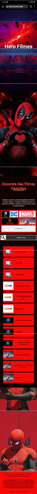

# Hero Filmes - Seu Destino Cinematográfico 🎬

### Link: https://hero-filmes.vercel.app/

Bem-vindo ao Hero Filmes, o seu portal cinematográfico extraordinário! Este projeto foi desenvolvido com paixão e as mais recentes tecnologias web. 🚀

## Tecnologias Utilizadas

- **ReactJS:** A espinha dorsal do Hero Filmes, proporcionando uma experiência de usuário dinâmica e reativa.
- **useState:** Gerenciamento de estado inteligente para garantir interatividade e atualizações dinâmicas.
- **Responsividade:** Design adaptável para proporcionar uma experiência perfeita em qualquer dispositivo.
- **Scroll Revel:** Efeitos de scroll envolventes para uma experiência de navegação única.
- **Eventos `onClick` e `onChange`:** Interatividade aprimorada para uma experiência de usuário mais envolvente.
- **Componentização:** Estrutura modular para facilitar a manutenção e reutilização de código.

## Visualizações do Site

### Desktop

[Desktop]

### Tablet

![Tablet]

### Mobile

![Mobile]

## Como Visualizar

1. **Clone o Repositório:**
   ```bash
   git clone https://github.com/andersongilvan/hero_filmes
   ```
